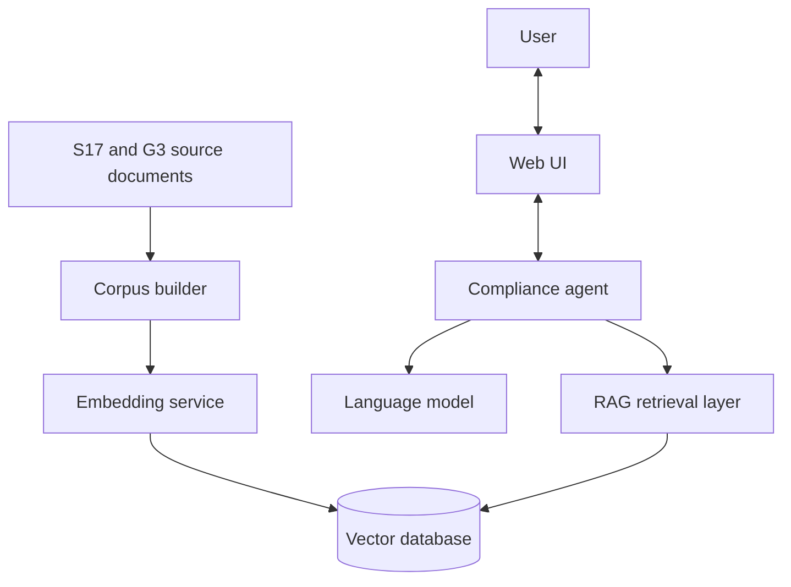
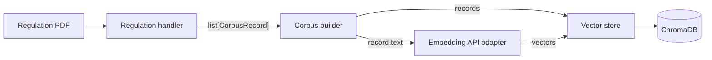

# S17/G3 AI Security Compliance Assistant

This document describes the confirmed goals, architecture, module boundaries, and core data contracts of the project.

## 1. Objective

The project aims to build an AI-assisted security-compliance review system combining an agent, retrieval-augmented generation (RAG), and a web interface. Hong Kong Government Security Regulation S17 and the related G3 guidelines form the initial reference corpus.

The system is intended to support three levels of input:

| Level | Input | Intended outcome |
| --- | --- | --- |
| 1 | A question about a regulation | Answer with traceable support from the source material |
| 2 | An organization's internal policies | Identify differences between internal policy and the applicable guidance |
| 3 | A project or system specification | Review the specification against relevant security requirements |

## 2. High-level architecture



Corpus construction is an offline operation performed when a source is first added or updated. Compliance review is an online workflow in which the agent retrieves relevant evidence before generating a response.

## 3. Module boundaries

### 3.1 Corpus builder

`src/corpus_builder/` converts source regulations into validated, retrievable records and maintains the local vector store.

| Component | Responsibility |
| --- | --- |
| `models.py` | Defines and validates the shared `CorpusRecord` data type |
| `handle_s17.py` | Parses the English S17 PDF and returns structured records |
| `build_corpus.py` | Runs registered handlers, checks global ID uniqueness, requests embeddings, and stores the results |
| `vector_store.py` | Stores records with existing vectors and performs nearest-neighbor retrieval through ChromaDB |

Regulation-specific handlers only parse and transform their own sources. They do not call an embedding service or write to the database. This separation allows future G3 and other handlers to reuse the same record and storage interfaces.

`src/api/embedded_api.py` is the shared text-to-vector adapter. It preserves input order across batches and isolates external embedding-service behavior from the corpus and retrieval layers.



### 3.2 RAG retrieval layer

The planned `src/rag/` module accepts a user question and returns assembled regulatory evidence for the agent. Internally, it will reuse `CorpusRecord` rather than introduce another cross-module record type.

Its intended components are:

- a retriever that embeds the question and queries the vector store;
- a result processor that removes duplicate record IDs and limits the final result set; and
- a server-facing interface that formats the selected records as evidence for the agent.

Hybrid retrieval with BM25 is planned but not yet implemented.

### 3.3 Agent

The agent module will coordinate user input, regulatory retrieval, and language-model reasoning. Its detailed design has not yet been finalized.

### 3.4 Web UI

The web interface will collect questions or documents, show the review process, and present evidence-backed results. Its detailed design has not yet been finalized.

## 4. Core data contract

All corpus and retrieval components share the following immutable record shape:

```python
@dataclass(frozen=True)
class CorpusRecord:
    id: str
    text: str
    metadata: Mapping[str, str | int | float | bool]
```

For S17, `text` contains the section, parent sections, and original clause text in a stable three-line format:

```text
Section: 15.2.2
Parent sections: 15. COMMUNICATIONS SECURITY > 15.2. Information Transfer
Text: CONFIDENTIAL/RESTRICTED information shall be encrypted...
```

Metadata retains traceability information such as the document, version, language, section, source filename, PDF page, printed page, split lineage, word count, and content hash. The same contextualized `text` is embedded, stored as the ChromaDB document, and returned from queries.

## 5. Testing strategy

Automated tests mirror the production modules under `tests/`. They cover record validation and immutability, PDF parsing and chunk traceability, corpus orchestration, embedding batching and response validation, and vector-store persistence and ordering.

Tests must remain deterministic and must not call the real embedding service. External requests and PDF readers are replaced with controlled test doubles where appropriate.

## 6. Data boundaries

Raw source documents, generated chunks, user uploads, credentials, embeddings, and local vector databases are not public repository artifacts. Public documentation describes provenance and behavior without publishing private or generated data.
