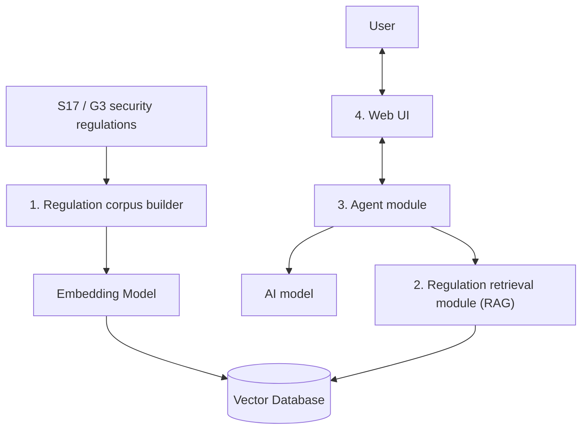
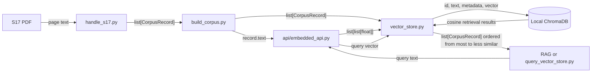
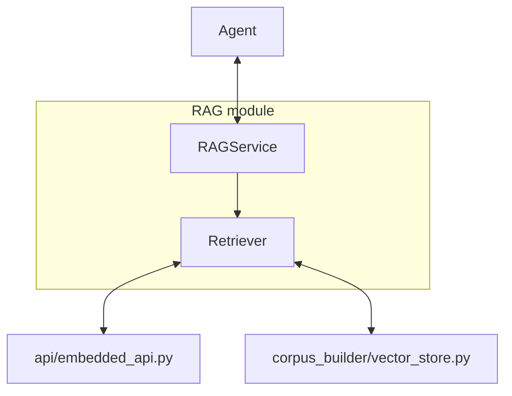

# S17/G3 AI Security Compliance Assistant: Project Framework

> This document records only the confirmed system objectives, functions, and module boundaries.

## 1. Project Objective

Develop an AI security compliance review system composed of an **Agent, RAG, and Web UI**.

The system uses Hong Kong's **S17** and **G3** as its initial example regulations. The Agent queries relevant regulations through RAG, interacts with the user, and produces review results.

## 2. Three Input Levels

| Level | Input | Objective |
| --- | --- | --- |
| Level 1 | User questions about regulations | Provide basic AI question answering supported by actual regulations. |
| Level 2 | A collection of examples from a company's own rules or internal policies | Identify content that is inconsistent with the more authoritative regulations. |
| Level 3 | An example of a company's project specification | Review whether the project complies with the relevant security regulations. |

## 3. High-Level System Architecture



## 4. Module Boundaries

| Module | Function |
| --- | --- |
| 1. Regulation corpus builder | Read S17/G3, use an embedding model, and build the Vector Database. |
| 2. Regulation retrieval module (RAG) | Find relevant regulation content in the Vector Database based on the Agent's query. |
| 3. Agent module | Receive user input, call the AI model and regulation retrieval module, read the retrieved results, and produce review results. |
| 4. Web UI | Interact with the user by receiving input and displaying the process and results. |

### Corpus Build Flow (Offline)

1. The regulation corpus builder reads the S17/G3 source material.
2. The regulation corpus builder uses an embedding model to write the regulation content to the Vector Database.

The corpus is built only when the database is first created or when the regulations are updated.

### User Review Flow (Online)

1. The user enters a question, an internal company policy, or a project specification in the Web UI.
2. The Web UI sends the input to the Agent.
3. The Agent queries the relevant regulations through RAG.
4. RAG returns relevant content from the Vector Database.
5. The Agent calls the AI model, reads the input and retrieved results, and produces the review result.
6. The Web UI displays the result to the user.

## 5. Detailed Implementation of the Four Modules

### 5.1 `corpus_builder`

`src/corpus_builder/` converts original regulation documents into a retrievable corpus and maintains the local vector store. It defines a unified regulation record format, while regulation-specific programs handle only the structure of their respective PDFs. The vector storage module does not call the embedding API; it only accepts vectors that have already been generated. S17 is the current formal implementation. Future regulations can add their own `handle` programs while reusing the same data type and vector-store interfaces.

#### Submodules

| File | Responsibility | Main input and output |
| --- | --- | --- |
| `models.py` | Define and validate the shared data type. | `CorpusRecord` |
| `handle_s17.py` | Read an English S17 PDF supplied by the caller, filter and split it according to the regulation structure, and create records; do not call the embedding API or storage module. | `Path` → `list[CorpusRecord]` |
| `build_corpus.py` | Call registered handlers in sequence, merge and validate their records, then coordinate embedding generation and ChromaDB writes. | multiple handlers → `list[CorpusRecord]` + vectors → ChromaDB |
| `vector_store.py` | Maintain embedded ChromaDB, store records and vectors, and retrieve the nearest records. | records + vectors ↔ ChromaDB; query vector → `list[CorpusRecord]` |

`src/api/embedded_api.py` is the shared API wrapper outside this module. It converts text into vectors and guarantees that batch output follows the input order.

#### Information Flow



Each handler accepts only a PDF `Path` and returns `list[CorpusRecord]`. The handler directly combines `Section`, `Parent sections`, and the original `Text` into `record.text`. `build_corpus.py` merges records from all handlers, validates globally unique IDs before calling an external API, and sends each `record.text` unchanged to the embedding API. The `id`, page numbers, source, and split-tracking information remain in the record metadata. The ChromaDB document and the `record.text` returned by queries contain the same contextualized text. During a query, `vector_store.py` uses cosine distance to find the nearest records and returns them from nearest to farthest without exposing distance as part of the public return value.

#### Internal Data Type

```python
@dataclass(frozen=True)
class CorpusRecord:
    id: str
    text: str
    metadata: Mapping[str, str | int | float | bool]
```

At the top level, `CorpusRecord` stores a unique ID and the `text` used for retrieval. S17 `text` always consists of three lines: `Section: ...`, `Parent sections: ...`, and `Text: ...`; the final line contains the original regulation text. Metadata is a flat key-value structure and must include `document`, `version`, `language`, `section`, `parent_titles`, `source_file`, `pdf_page_start`, and `printed_page_start`. It may also preserve split-tracking data such as `parent_chunk_id`, `part_number`, `part_count`, `split_method`, `word_count`, and `text_sha256`. `word_count` counts the source text on the `Text` line, while `text_sha256` corresponds to the complete text actually stored. Record creation validates required fields, value types, and non-empty constraints. Metadata is frozen to prevent accidental modification after the corpus has been built.

#### Test Cases

Tests are located under `tests/corpus_builder/` and use pytest. They do not call the real embedding API.

| Test file | Coverage |
| --- | --- |
| `test_models.py` | Required `CorpusRecord` metadata, type and value restrictions, reserved-field conflicts, and metadata immutability. |
| `test_handle_s17.py` | S17 PDF `Path` input requirements, PDF filtering and splitting, record metadata, and chunk-tracking information; the PDF reader is simulated with a test double. |
| `test_build_corpus.py` | Merging records from multiple handlers, unified embedding input and storage, and rejecting duplicate IDs across handlers before external calls. |
| `test_vector_store.py` | Single and batch writes to temporary ChromaDB, metadata round trips, similarity ordering, parameter validation, an empty database, and `top_k` values larger than the number of available records. |

`tests/scripts/test_check_embedding_api.py` covers the one-time embedding API check script. It uses the same three-line text format as an S17 record and validates the structure and dimensions of a single vector in the API response.

### 5.2 Regulation Retrieval Module (RAG)

`src/rag/` is responsible for retrieving relevant regulations from text supplied by the Agent. `RAGService` is the Agent-facing boundary and returns matching regulation texts as `list[str]`. It delegates to `Retriever`, which converts the question into a vector, retrieves similarity-ordered `CorpusRecord` objects, and returns their text in the same order. The first item is the most relevant match. No separate result-processing stage is implemented yet.

#### Submodules

| Submodule | Responsibility | Main input and output |
| --- | --- | --- |
| `RAGService` | Provide the Agent-facing interface and delegate the question to Retriever. | `str` → `list[str]` |
| `Retriever` | Convert Agent-supplied text into a vector, retrieve relevant regulation records, and return their text without changing similarity order. | `str` → `list[str]` |

#### Information Flow



`Retriever` uses `api/embedded_api.py` to convert the supplied text into a vector and calls `corpus_builder/vector_store.py` to obtain `list[CorpusRecord]` ordered from most to least similar. It then returns each `CorpusRecord.text` as `list[str]` without reordering the results. Embedding API coordination belongs to `Retriever`; the vector store continues to accept only vectors and does not call external APIs. Deduplication, reranking, and other result processing are deferred.

### 5.3 Agent Module

To be determined.

The initial `AgentService` provides `respond(text: str) -> str`. One service instance keeps an internal `list[Message]`, sends the accumulated user and assistant conversation to the language-model API, stores the returned assistant reply, and returns that reply. `Message` is defined by the API module because it follows the chat-completions message contract and supports `system`, `user`, and `assistant` roles. The service parses the model's JSON response; an `answer` stores and returns its content, while a `tool_call` for `retrieve_regulations` calls `RAGService` once and sends the joined `list[str]` evidence back to the model for a final answer.

`src/agent/prompts.py` defines the system message separately from conversation history. It describes the security-compliance context, instructs the model to decide whether regulatory evidence is needed, and defines JSON-only `answer` and `tool_call` responses. The only declared tool is `retrieve_regulations`, whose `arguments.text` contains the text to retrieve. The system message is prepended for each model request but is not stored as user-visible conversation history.

The system message identifies the current retrieval scope as the English S17 v8.2 corpus only. It states that G3, other regulations or standards, private company documents, and Internet content are not present, and requires the Agent to disclose this limitation instead of claiming unavailable material was retrieved.

Tool-call JSON remains temporary orchestration data. When retrieval runs, the service appends one visible `system` message containing the retrieval text and joined results, followed by the final assistant answer. `AgentService.messages` returns a copy of the visible conversation list so callers such as the terminal script can display system messages without modifying internal state.

### 5.4 Web UI

To be determined.

## 7. Current File Structure

```text
fyp_project/
├─ .gitignore                   # Git ignore rules
├─ environment.yml              # Conda environment definition
├─ README.md                    # Project entry point
│
├─ data/
│  ├─ raw/standards/            # Original S17/G3 PDFs
│  │  ├─ en/                    # English sources (primary corpus for Plan 1)
│  │  └─ zh-Hans/               # Chinese sources (future separate index)
│  ├─ processed/                # Intermediate data for the formal corpus build
│  ├─ uploads/                  # Future user uploads
│  └─ vector_db/                # Local Vector Database
│
├─ docs/
│  ├─ FRAMEWORK.md              # This document
│  └─ PROCESS_AND_PLAN.md       # Plan and progress record
│
├─ scripts/
│  ├─ build_corpus.py           # Unified regulation corpus build command
│  ├─ check_embedding_api.py    # Manual embedding API check
│  └─ query_vector_store.py     # Manual vector-store query
│
├─ exp/                         # Experimental code
│  ├─ build_s17_chunks.py       # V1: split by regulation number
│  ├─ build_s17_chunks_v2.py    # V2: semantic subdivision experiment
│  └─ output/                   # Experimental output (not committed to Git)
│     ├─ s17_en_chunks.jsonl
│     ├─ s17_en_chunks_review.md
│     ├─ s17_en_chunk_report.json
│     ├─ s17_en_retrieval_chunks_v2.jsonl
│     ├─ s17_en_retrieval_chunks_v2_review.md
│     └─ s17_en_retrieval_chunks_v2_report.json
│
├─ src/
│  ├─ agent/                    # Agent module
│  ├─ api/                      # External API wrappers
│  │  └─ embedded_api.py        # Text → vector
│  ├─ corpus_builder/           # Formal corpus-building code
│  │  ├─ models.py              # CorpusRecord type and metadata validation
│  │  ├─ handle_s17.py          # S17 PDF Path → list[CorpusRecord]
│  │  ├─ build_corpus.py        # Unified corpus build entry point
│  │  └─ vector_store.py        # Vector storage and queries using ChromaDB
│  ├─ rag/                      # RAG module
│  └─ web_ui/                   # Web UI
│
└─ tests/
   ├─ api/
   │  └─ test_embedded_api.py   # embedded_api QA tests
   ├─ corpus_builder/
   │  ├─ test_build_corpus.py   # Unified corpus build tests
   │  ├─ test_handle_s17.py     # S17 handler tests
   │  ├─ test_models.py         # CorpusRecord tests
   │  └─ test_vector_store.py   # vector_store tests
   └─ scripts/
      └─ test_check_embedding_api.py  # One-time API check script tests
```
