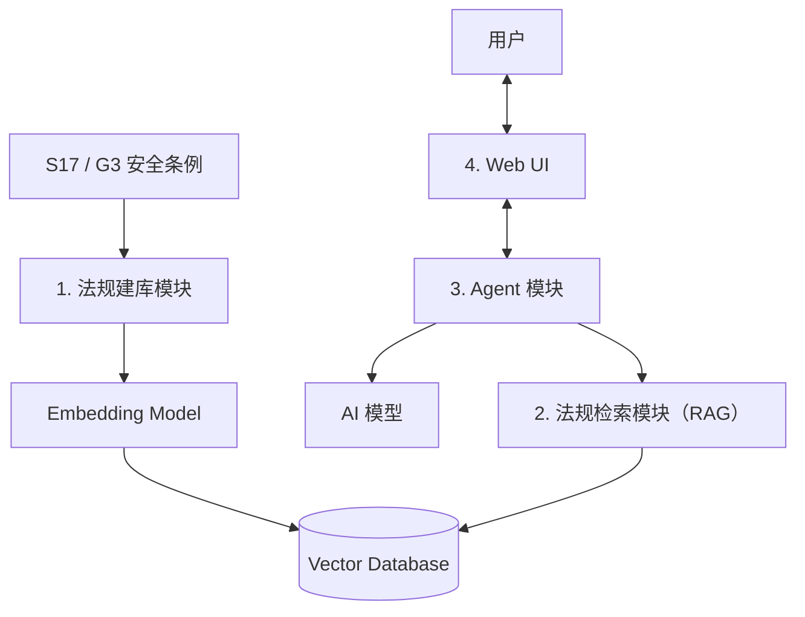
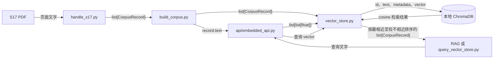
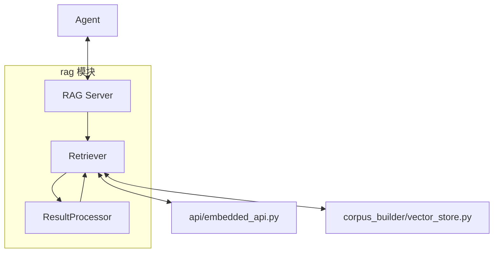

# S17/G3 AI 安全合规审查助手：项目框架

> 本文件只记录已确认的系统目标、功能和模块边界。

## 1. 项目目标

开发一个由 **Agent、RAG 和 Web UI** 组成的 AI 安全合规审查系统。

系统以香港本地的 **S17** 和 **G3** 作为示范条例。Agent 通过 RAG 查询相关条例，与用户交互，并输出审查结果。

## 2. 三个输入层级

| 层级 | 输入 | 目标 |
|---|---|---|
| 第一层 | 用户关于条例的问题 | 完成有实际条例支持的基础 AI 问答。 |
| 第二层 | 公司自有条例／内部政策的例子集合 | 找出内容与较规范条例不一致的地方。 |
| 第三层 | 公司的项目说明书实例 | 审核项目是否符合相关安全条例。 |

## 3. 高层系统架构



## 4. 模块边界

| 模块 |  功能|  |
|---|---|---|
| 1. 法规建库模块 |读取 S17/G3、使用 embedding model、建立 Vector Database。 |  |
| 2. 法规检索模块（RAG） | 根据 Agent 的查询，从 Vector Database 找出相关条例内容。 |  |
| 3. Agent 模块 | 接收用户输入，调用 AI 模型和法规检索模块，读取检索结果并输出审查结果。 |  |
| 4. Web UI | 与用户交互：接收输入、显示过程和结果。 |  |

### 建库流程（离线）

1. 法规建库模块读取 S17/G3 条例资料；
2. 法规建库模块使用 embedding model 将条例内容写入 Vector Database。

建库只在首次建立资料库或更新条例时运行。

### 用户审查流程（在线）

1. 用户在 Web UI 输入问题、公司内部政策或项目说明书；
2. Web UI 将输入交给 Agent；
3. Agent 通过 RAG 查询相关条例；
4. RAG 从 Vector Database 返回相关内容；
5. Agent 调用 AI 模型，读取输入和检索结果，并输出审查结果；
6. Web UI 将结果显示给用户。

## 5. 四个模块的具体实现

### 5.1 `corpus_builder`

`src/corpus_builder/` 负责将法规原件转换为可检索的语料，并维护本地向量库。它定义统一的法规记录格式，条例专属程序只处理各自 PDF 的结构；向量储存模块不调用 embedding API，只接收已生成的向量。当前以 S17 为正式实现，后续条例可新增各自的 `handle` 程序并复用相同的数据类型与向量库接口。

#### 子模块

| 文件 | 职责 | 主要输入与输出 |
| --- | --- | --- |
| `models.py` | 定义并验证共享资料类型。 | `CorpusRecord` |
| `handle_s17.py` | 读取调用方提供的英文 S17 PDF，按条例结构筛选、切分并建立 records；不调用 embedding API 或储存模块。 | `Path` → `list[CorpusRecord]` |
| `build_corpus.py` | 依次调用已登记的 handlers，合并并验证 records，再协调 embedding 与 ChromaDB 写入。 | 多个 handlers → `list[CorpusRecord]` + vectors → ChromaDB |
| `vector_store.py` | 维护嵌入式 ChromaDB，储存 record 与 vector，并检索最近的 records。 | records + vectors ↔ ChromaDB；query vector → `list[CorpusRecord]` |

`src/api/embedded_api.py` 是模块外的共用 API 封装：负责将文本转换为向量，并保证批量输出与输入顺序一致。

#### 信息交互



每个 handler 只接收 PDF `Path` 并返回 `list[CorpusRecord]`。handler 会直接将 `Section`、`Parent sections` 和原文 `Text` 组成 `record.text`；`build_corpus.py` 负责合并各 handler 的 records、在调用外部 API 前验证全局 ID 唯一，并原样将 `record.text` 送入 embedding API。`id`、页码、来源及切分追踪资料保留在 record 的 metadata。ChromaDB 的 document 与查询返回的 `record.text` 都是相同的带上下文文本；查询时，`vector_store.py` 以 cosine distance 找出最近记录，并按由近至远的顺序返回，不把 distance 暴露为公共返回值。

#### 模块内数据类型

```python
@dataclass(frozen=True)
class CorpusRecord:
    id: str
    text: str
    metadata: Mapping[str, str | int | float | bool]
```

`CorpusRecord` 的顶层保存唯一 ID 与用于检索的 `text`。S17 的 `text` 固定为 `Section: ...`、`Parent sections: ...`、`Text: ...` 三行，最后一行包含原始法规正文；metadata 为扁平键值资料，必须含有 `document`、`version`、`language`、`section`、`parent_titles`、`source_file`、`pdf_page_start` 与 `printed_page_start`。它也可保存 `parent_chunk_id`、`part_number`、`part_count`、`split_method`、`word_count` 与 `text_sha256` 等切分追踪资料；`word_count` 统计 `Text` 行中的原文，`text_sha256` 则对应完整的实际储存文本。建立 record 时会验证必填字段、值类型与非空约束；metadata 会被冻结，避免建库后的内容被意外修改。

#### Test cases

测试均位于 `tests/corpus_builder/`，并使用 pytest；测试不调用真实 embedding API。

| 测试文件 | 覆盖内容 |
| --- | --- |
| `test_models.py` | `CorpusRecord` 的必填 metadata、类型与取值限制、保留字段冲突，以及 metadata 不可变性。 |
| `test_handle_s17.py` | S17 PDF `Path` 的输入要求、PDF 筛选与切分、record metadata 和分块追踪资料；PDF 阅读器由测试替身模拟。 |
| `test_build_corpus.py` | 多个 handlers 的 records 合并、统一 embedding 输入与写入，以及跨 handler 重复 ID 在外部调用前被拒绝。 |
| `test_vector_store.py` | 临时 ChromaDB 中的单条与批量写入、metadata 往返、相似度排序、参数验证、空库和超过可用记录数的 `top_k`。 |

`tests/scripts/test_check_embedding_api.py` 覆盖一次性 embedding API 检查脚本：它使用与 S17 record 相同的三行文本格式，并验证 API 回应中的单条向量结构和维度。


### 5.2 法规检索模块（RAG）

`src/rag/` 负责按用户问题检索相关法规，并向 Agent 返回整合后的法规证据文本。RAG 对 Agent 只暴露一个接口：输入用户问题 `str`，输出法规证据 `str`。内部检索和处理阶段统一使用既有的 `CorpusRecord`，不新增跨模块资料类型。

#### 子模块

| 子模块 | 职责 | 主要输入与输出 |
| --- | --- | --- |
| `RAG Server` | 直接与 Agent 对接；将最终 records 拼成法规证据文字。 | `str` → `str` |
| `Retriever` | 将问题转为向量，并从向量库检索相关法规 records；随后调用 `ResultProcessor`。 | `str` → `list[CorpusRecord]` |
| `ResultProcessor` | 按 record ID 去重，并截取最终条数。 | `list[CorpusRecord]` → `list[CorpusRecord]` |

#### 信息交互



`Retriever` 使用 `api/embedded_api.py` 将问题转换为向量，并通过 `corpus_builder/vector_store.py` 返回按相近程度排序的 `list[CorpusRecord]`。`ResultProcessor` 以 `CorpusRecord.id` 识别重复记录，并保留最终所需数量。`RAG Server` 读取 record 的 `text` 和 metadata，将结果拼成供 Agent 使用的法规证据文字。

### 5.3 Agent 模块

待确定。

### 5.4 Web UI

待确定。


## 7. 当前文件目录

```text
fyp_project/
├─ .gitignore                   # Git 忽略规则
├─ environment.yml              # Conda 环境定义
├─ README.md                    # 项目入口说明
│
├─ data/
│  ├─ raw/standards/            # S17/G3 原始 PDF
│  │  ├─ en/                    # 英文原件（Plan 1 主语料）
│  │  └─ zh-Hans/               # 中文原件（后续独立索引）
│  ├─ processed/                # 后续正式建库的处理中间数据
│  ├─ uploads/                  # 后续的用户上传文件
│  └─ vector_db/                # 后续建立的 Vector Database
│
├─ docs/
│  ├─ PROJECT_FRAMEWORK.md      # 本文件
│  ├─ PROJECT_PLAN_AND_PROGRESS.md #规划和进度记录
│  └─ STANDARDS.md              # 条例来源和版本清单
│
├─ scripts/
│  ├─ build_corpus.py           # 统一法规建库命令入口
│  ├─ check_embedding_api.py    # 手动检查 embedding API
│  └─ query_vector_store.py     # 手动查询向量库
│
├─ exp/                         # 实验代码
│  ├─ build_s17_chunks.py       # V1：按法规编号切分
│  ├─ build_s17_chunks_v2.py    # V2：语义细分实验
│  └─ output/                   # 实验产生的数据（不提交 Git）
│     ├─ s17_en_chunks.jsonl
│     ├─ s17_en_chunks_review.md
│     ├─ s17_en_chunk_report.json
│     ├─ s17_en_retrieval_chunks_v2.jsonl
│     ├─ s17_en_retrieval_chunks_v2_review.md
│     └─ s17_en_retrieval_chunks_v2_report.json
│
├─ src/
│  ├─ agent/                    # agent模块
│  ├─ api/                      # 外部 API 封装
│  │  └─ embedded_api.py         # 文本 → 向量
│  ├─ corpus_builder/           # 后续正式语料库构建代码
│  │  ├─ models.py               # CorpusRecord 数据类型与 metadata 验证
│  │  ├─ handle_s17.py           # S17 PDF Path → list[CorpusRecord]
│  │  ├─ build_corpus.py         # 统一建库入口
│  │  └─ vector_store.py         # 向量储存与查询（内部使用 ChromaDB）
│  ├─ rag/                      # rag模块
│  └─ web_ui/                   # 网页UI
│
└─ tests/
   ├─ api/
   │  └─ test_embedded_api.py   # embedded_api QA 测试
   ├─ corpus_builder/
      ├─ test_build_corpus.py   # 统一建库入口测试
      ├─ test_handle_s17.py     # S17 handler 测试
      ├─ test_models.py         # CorpusRecord 测试
      └─ test_vector_store.py   # vector_store 测试
   └─ scripts/
      └─ test_check_embedding_api.py  # 一次性 API 检查脚本测试
```
