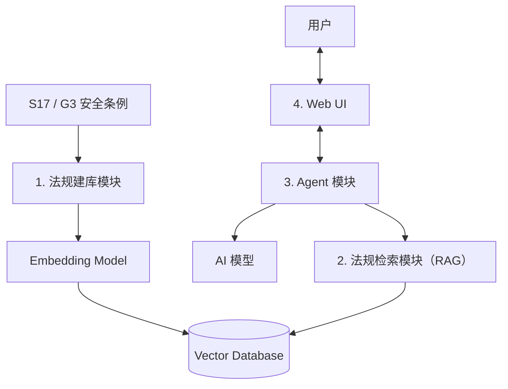

# S17/G3 AI 安全合规审查助手：项目框架

> 本文件只记录已确认的系统目标、功能和模块边界。

## 1. 项目目标

开发一个由 **Agent、RAG 和 Web UI** 组成的 AI 安全合规审查系统。

系统以香港本地的 **S17** 和 **G3** 作为示范条例。Agent 通过 RAG 查询相关条例，与用户交互，并输出审查结果。

## 2. 三个输入层级

| 层级 | 输入 | 目标 |
|---|---|---|
| 第一层 | 用户关于条例的问题 | 完成有实际条例支持的基础 AI 问答。 |
| 第二层 | 公司自有条例／内部政策的例子集合 | 找出内容与较规范条例不一致的地方。 |
| 第三层 | 公司的项目说明书实例 | 审核项目是否符合相关安全条例。 |

## 3. 高层系统架构



## 4. 模块边界

| 模块 |  功能|  |
|---|---|---|
| 1. 法规建库模块 |读取 S17/G3、使用 embedding model、建立 Vector Database。 |  |
| 2. 法规检索模块（RAG） | 根据 Agent 的查询，从 Vector Database 找出相关条例内容。 |  |
| 3. Agent 模块 | 接收用户输入，调用 AI 模型和法规检索模块，读取检索结果并输出审查结果。 |  |
| 4. Web UI | 与用户交互：接收输入、显示过程和结果。 |  |

### 建库流程（离线）

1. 法规建库模块读取 S17/G3 条例资料；
2. 法规建库模块使用 embedding model 将条例内容写入 Vector Database。

建库只在首次建立资料库或更新条例时运行。

### 用户审查流程（在线）

1. 用户在 Web UI 输入问题、公司内部政策或项目说明书；
2. Web UI 将输入交给 Agent；
3. Agent 通过 RAG 查询相关条例；
4. RAG 从 Vector Database 返回相关内容；
5. Agent 调用 AI 模型，读取输入和检索结果，并输出审查结果；
6. Web UI 将结果显示给用户。

## 5. 四个模块的具体实现

### 5.1 法规建库模块

- 每份条例有一个独立的 `build` 程序；该程序读取对应 PDF，并按该条例自己的结构筛选和切分内容；
- `build` 程序将每个 chunk 交给 `embedded_api` 转为向量，再交给 `chromadb` 模块储存；
- 每个 chunk 的 embedding 输入只包含：`section`、`parent_titles`（上级章节）和 `text`（条款正文）；
- 当前实验以 SiliconFlow 的 `Qwen/Qwen3-VL-Embedding-8B` 生成 4096 维向量；
- 当前实验使用嵌入式本地 ChromaDB；数据库存于 `data/vector_db/`，无需独立数据库服务器；
- ChromaDB 的每条记录由 `id`、向量、原始 `text` 与 metadata 组成；建库 manifest 记录输入文件、模型、向量维度、批次大小和建库时间；

#### 支撑模块

```text
build（每份条例独立）
  读取 PDF → 筛选 / 切分 → 调用 embedded_api → 调用 vector_store 储存

src/api/embedded_api.py（外部 API）
  接口：embed_text(txt) → vector
        embed_texts([txt, ...]) → [vector, ...]
  批量输出顺序与输入一致

src/corpus_builder/vector_store.py（共用）
  接口：store_vector(record, vector)
        store_vectors(records, vectors)
        query_vectors(vector, top_k=3) → 最相近的法规记录
  内部使用 ChromaDB；不处理文本 embedding
```

#### 


### 5.2 法规检索模块（RAG）

待确定。

### 5.3 Agent 模块

待确定。

### 5.4 Web UI

待确定。

## 6. 测试

| 被测试模块 | 测试文件 | 已测试内容 |
|---|---|---|
| `src/api/embedded_api.py` | `tests/api/test_embedded_api.py` | 单条输入、9 条拆分为 8 + 1、空输入、空文字、异常 response index。 |
| `src/corpus_builder/vector_store.py` | `tests/corpus_builder/test_vector_store.py` | 单条储存与查询、批量储存和排序、数量不一致、无效查询参数。 |

测试使用 pytest 的 `monkeypatch` 临时替换网络请求，因此不调用真实 API、不消耗额度。

## 7. 当前文件目录

```text
fyp_project/
├─ .gitignore                   # Git 忽略规则
├─ environment.yml              # Conda 环境定义
├─ README.md                    # 项目入口说明
│
├─ data/
│  ├─ raw/standards/            # S17/G3 原始 PDF
│  │  ├─ en/                    # 英文原件（Plan 1 主语料）
│  │  └─ zh-Hans/               # 中文原件（后续独立索引）
│  ├─ processed/                # 后续正式建库的处理中间数据
│  ├─ uploads/                  # 后续的用户上传文件
│  └─ vector_db/                # 后续建立的 Vector Database
│
├─ docs/
│  ├─ PROJECT_FRAMEWORK.md      # 本文件
│  ├─ PROJECT_PLAN_AND_PROGRESS.md #规划和进度记录
│  └─ STANDARDS.md              # 条例来源和版本清单
│
├─ scripts/
│  └─ check_embedding_api.py    # 手动检查 embedding API
│
├─ exp/                         # 实验代码
│  ├─ build_s17_chunks.py       # V1：按法规编号切分
│  ├─ build_s17_chunks_v2.py    # V2：语义细分实验
│  └─ output/                   # 实验产生的数据（不提交 Git）
│     ├─ s17_en_chunks.jsonl
│     ├─ s17_en_chunks_review.md
│     ├─ s17_en_chunk_report.json
│     ├─ s17_en_retrieval_chunks_v2.jsonl
│     ├─ s17_en_retrieval_chunks_v2_review.md
│     └─ s17_en_retrieval_chunks_v2_report.json
│
├─ src/
│  ├─ agent/                    # agent模块
│  ├─ api/                      # 外部 API 封装
│  │  └─ embedded_api.py         # 文本 → 向量
│  ├─ corpus_builder/           # 后续正式语料库构建代码
│  │  └─ vector_store.py         # 向量储存与查询（内部使用 ChromaDB）
│  ├─ rag/                      # rag模块
│  └─ web_ui/                   # 网页UI
│
└─ tests/
   └─ api/
      └─ test_embedded_api.py   # embedded_api QA 测试
   └─ corpus_builder/
      └─ test_vector_store.py   # vector_store QA 测试
```
